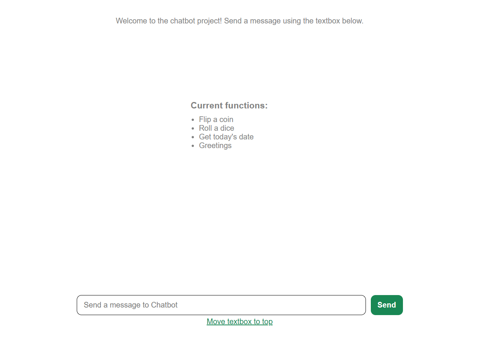
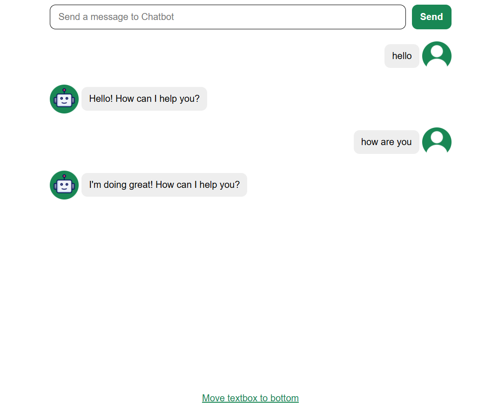

# React + Vite

# 💬 Chatbot Application

A simple and interactive Chatbot built with **React** and **Vite**.  
This project demonstrates dynamic message handling, responsive UI, and smooth user interaction using modern frontend technologies.  

🚀 **Live Demo**  
🔗 http://chat-bot-proj.netlify.app

---

## 📌 Features
🤖 Chat interface with responses  
⌨️ Input box for sending user queries  
💬 Display of bot and user messages in a clean, styled UI  
📱 Responsive design for mobile and desktop  
⚡ Built with Vite for fast development and hot module replacement  

---

## 🛠️ Tech Stack
- **React** – UI Components  
- **Vite** – Development & Build Tool  
- **JavaScript (ES6)** – Functionality  
- **CSS3** – Styling & Layout  

---

## 📸 Screenshots

## Main Interphase

## Chatting Interphase

---

